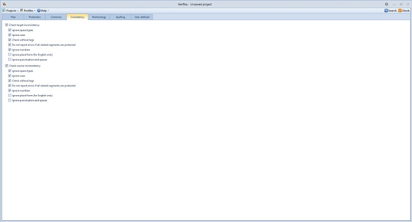
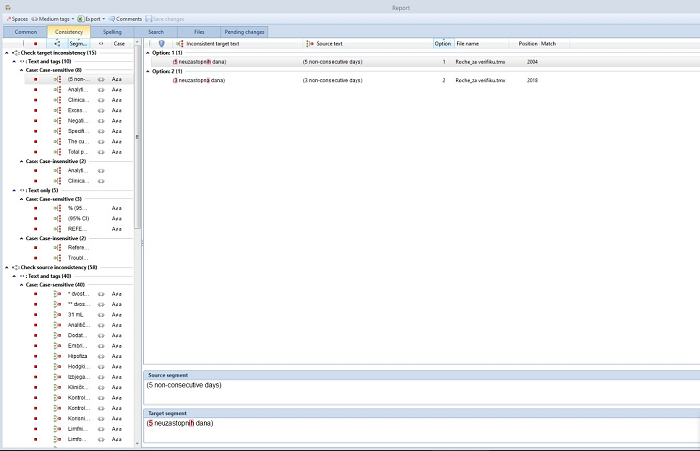

**Consistency Check Feature**

The consistency check feature detects different translations for the same source
segments, as well as different source segments translated identically. Before
clicking on **Check** and initiating a bilingual file analysis, an option to
manually select types of consistency errors that need to be detected in the
project is available. Otherwise, the default Verifika profile is activated, with
the most frequently used preferences preselected.

The manual selection of specific types of consistency errors is performed in the
**Consistency tab** of the **main window** (*Figure 1*).

*Figure 1*

Two main inconsistency categories that can be detected via the consistency check
feature are target inconsistencies and source inconsistencies. They can be
included in the analysis by choosing **Check target inconsistency** and **Check
source inconsistency**, respectively.

The **Check target inconsistency** option refers to different translations for
the same source segments and includes the following preferences:

• **Ignore space types**: If two segments differ only in the kind (but not in
number) of spaces used, it will not be reported as an error.

• **Ignore case**: An additional case-insensitive check to detect errors in
segments that otherwise could be deemed different.

• **Check without tags**: An additional check ignoring tags in order to detect
errors in segments that otherwise could be deemed different.

• **Do not report errors if all related segments are protected**: Avoid
reporting consistency errors if all inconsistent segments are protected.

• **Ignore numbers**: Perform an additional check while ignoring numbers in
order to detect errors in segments that otherwise could be deemed different.

• **Ignore plural form (for English only)**: Perform an additional check which
considers words in singular and plural forms as the same word.

• **Ignore punctuation and spaces**: When this option is on, punctuation and
separators are not taken into account.

The **Check source inconsistency** option refers to different source segments
translated identically and includes the same preferences as the Check target
inconsistency option.

After choosing preferred types of inconsistency errors (or skipping this part
altogether in order to activate default preferences), the analysis is performed
by clicking on **Check**.

The **Report window** appears containing the consistency report in the
**Consistency tab**.

*Figure 2*

The list of detected consistency errors is structured according to the following
parameters (see *Figure 2* for reference):

1.  Type of inconsistency (source or target inconsistency).

2.  Type of error detected.

3.  Segments that make up this group.

Further work with the consistency report is the same as working with the general
report: all steps for resolving errors in the general report apply to resolving
errors in the consistency report. However, it is recommended to first resolve
all errors in the general report (available in the **Common tab**) since
changing a segment in which an inconsistency error was previously ignored may
not automatically remove the **No error** status from the segment. The
consistency report is included in the exported Excel report.

Single-sentence description to be used for release notes:

-   The new consistency check feature detects different translations for the
    same source segments and different source segments translated equally.
